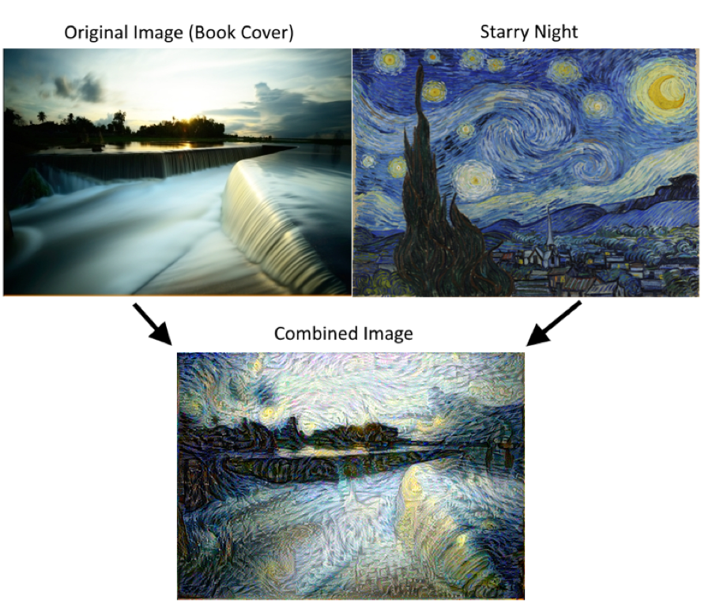

Stylenet / Neural-Style
=======================

The purpose of this script is to illustrate how to do stylenet in TensorFlow.  
We reference the following [paper](https://arxiv.org/abs/1508.06576) for this algorithm.

We use two images, a content image and a style image and try to make the content image in the style of the style image.

